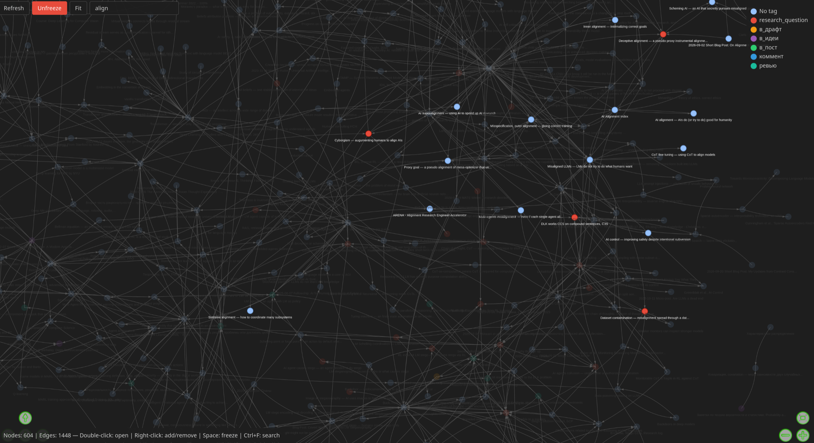

# zk-graph

Interactive, browser-based view of the link graph of a [zk](https://github.com/zk-org/zk) notebook.

A single Python script (standard library only) runs `zk graph`, serves the result on `127.0.0.1`, and draws it with [vis-network](https://visjs.github.io/vis-network/). It works well on notebooks with thousands of notes.

## Features

- Force-directed graph of all notes and links, or only the part around a search term or path prefix.
- Node size grows (logarithmically) with the number of distinct notes a note is linked with, so hubs stand out.
- Hover a note to see its title, tags, outgoing/backlink counts and the first lines of its body.
- **Double-click** a note to open it in your editor (configurable command).
- **Right-click** a note to expand the graph from there: add *all linked notes*, only its *outgoing links*, or only its *backlinks*. You can also *remove* it from the view.
- **Refresh** re-reads the notebook and updates the displayed notes, dropping deleted notes and syncing changed links.
- The graph is kept in memory. Expanding and refreshing only re-run `zk graph` if files in the notebook changed since the last load (checked by mtime, which takes milliseconds), so repeat clicks are instant even on large notebooks.
- Search box (**Ctrl+F**) dims non-matching notes; **Enter** jumps to the first match.
- **Space** freezes or unfreezes the physics simulation.
- Colour notes by tag.
- Works offline: vis-network is bundled, nothing is loaded from a CDN.

## Requirements

- Python ≥ 3.11
- [zk](https://github.com/zk-org/zk) in `PATH`, with an indexed notebook (`zk index`)
- A web browser

## Install

```sh
git clone https://github.com/artkpv/zk-graph.git
ln -s "$PWD/zk-graph/zk-graph" ~/.local/bin/zk-graph
```

Keep `vis-network.min.js` next to the script. The symlink is resolved, so linking the script from elsewhere is fine.

## Screenshot



## Usage

Run it from anywhere inside a notebook:

```sh
zk-graph                                  # whole notebook
zk-graph --filter "attention"             # notes matching the text, plus their direct neighbours
zk-graph --filter-path 2025/ --depth 2    # notes under 2025/, plus two hops of links
zk-graph --filter "attention" --direction in   # ...plus the notes that link to them
zk-graph --notebook ~/notes --port 9000 --no-open
```

| Option | Default | Meaning |
|---|---|---|
| `--notebook DIR` | `$ZK_NOTEBOOK_DIR`, else nearest parent with `.zk/` | Notebook to show |
| `--filter TEXT` | – | Keep notes whose title, lead or path contains `TEXT` (case-insensitive) |
| `--filter-path PREFIX` | – | Keep notes whose path starts with `PREFIX` |
| `--depth N` | `1` | Also include notes up to `N` links away from the matched ones |
| `--direction both\|out\|in` | `both` | Which links `--depth` follows: `out` = notes they link to, `in` = backlinks |
| `--port N` | `8089` | HTTP port on 127.0.0.1 (`0` picks a free one) |
| `--no-open` | – | Don't open the browser automatically |

The browser is chosen by Python's `webbrowser` module, so `$BROWSER` is respected.

## Configuration

Optional, per notebook: `<notebook>/.zk/zk-graph.toml`. See [`zk-graph.example.toml`](zk-graph.example.toml).

```toml
# Command run on double-click. {path} = absolute note path, {notebook} = notebook dir.
# The path is appended if {path} is absent. It runs without a shell.
open_cmd = ["kitty", "nvim", "{path}"]

default_color = "#97c2fc"

# The first tag listed here that a note has decides its colour.
[tag_colors]
todo = "#e74c3c"
draft = "#f39c12"
```

Without a config file, notes open with `xdg-open` and all nodes share one colour.

## Security

The server only listens on `127.0.0.1`. The page gets a random per-run token, and every action endpoint (`/open`, `/neighbors`, `/refresh`) requires it in a custom header. The server also rejects requests whose `Host` header isn't its own. So other websites open in your browser can't open files or read your notes, whether by cross-site requests or DNS rebinding. Note paths are only opened if they exist in the notebook, and the open command is run without a shell.

## License

MIT, see [LICENSE](LICENSE). The bundled `vis-network.min.js` (v10.0.2) is © vis.js contributors, dual-licensed Apache-2.0 / MIT. Its licence header is kept in the file.
