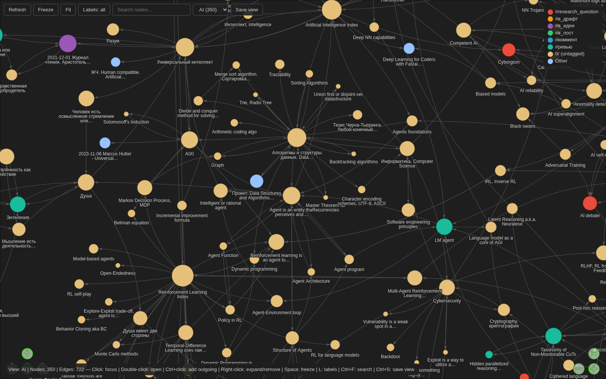

# zk-graph

Interactive, browser-based view of the link graph of a [zk](https://github.com/zk-org/zk) notebook.

A single Python script (standard library only) runs `zk graph`, serves the result on `127.0.0.1`, and draws it with [vis-network](https://visjs.github.io/vis-network/). It works well on notebooks with thousands of notes.

## Features

- Force-directed graph of all notes and links, or only the part around a search term or path prefix.
- Node size grows (logarithmically) with the number of distinct notes a note is linked with, so hubs stand out.
- Hover a note to see its title, tags, outgoing/backlink counts and the first lines of its body.
- **Double-click** a note to open it in your editor (configurable command).
- **Right-click** a note to expand the graph from there: add *all linked notes*, only its *outgoing links*, or only its *backlinks*. You can also *remove* it from the view.
- **Ctrl+click** (⌘+click on macOS) a note is a shortcut for adding its outgoing links.
- **Refresh** re-reads the notebook and updates the displayed notes, dropping deleted notes and syncing changed links.
- The graph is kept in memory. Expanding and refreshing only re-run `zk graph` if files in the notebook changed since the last load (checked by mtime, which takes milliseconds), so repeat clicks are instant even on large notebooks.
- **Saved views**: save the current set of notes, their positions and the zoom (**Save view** / **Ctrl+S**), switch between views from the dropdown, or open one with `--view NAME`. See [Saved views](#saved-views).
- Search box (**Ctrl+F**) dims non-matching notes; **Enter** jumps to the first match.
- **Space** freezes or unfreezes the physics simulation.
- Colour notes by tag.
- Works offline: vis-network is bundled, nothing is loaded from a CDN.

## Requirements

- Python ≥ 3.11
- [zk](https://github.com/zk-org/zk) in `PATH`, with an indexed notebook (`zk index`)
- A web browser

## Install

```sh
git clone https://github.com/artkpv/zk-graph.git
ln -s "$PWD/zk-graph/zk-graph" ~/.local/bin/zk-graph
```

Keep `vis-network.min.js` next to the script. The symlink is resolved, so linking the script from elsewhere is fine.

## Screenshot



## Usage

Run it from anywhere inside a notebook:

```sh
zk-graph                                  # whole notebook
zk-graph --filter "attention"             # notes matching the text, plus their direct neighbours
zk-graph --filter-path 2025/ --depth 2    # notes under 2025/, plus two hops of links
zk-graph --filter "attention" --direction in   # ...plus the notes that link to them
zk-graph --notebook ~/notes --port 9000 --no-open
zk-graph --list-views                     # saved views
zk-graph --view ml-reading                # open a saved view
```

| Option | Default | Meaning |
|---|---|---|
| `--notebook DIR` | `$ZK_NOTEBOOK_DIR`, else nearest parent with `.zk/` | Notebook to show |
| `--filter TEXT` | – | Keep notes whose title, lead or path contains `TEXT` (case-insensitive) |
| `--filter-path PREFIX` | – | Keep notes whose path starts with `PREFIX` |
| `--depth N` | `1` | Also include notes up to `N` links away from the matched ones |
| `--direction both\|out\|in` | `both` | Which links `--depth` follows: `out` = notes they link to, `in` = backlinks |
| `--view NAME` | – | Open a saved view instead of filtering (can't be combined with `--filter`/`--filter-path`) |
| `--list-views` | – | Print saved views (name, save time, note count) and exit |
| `--port N` | `8089` | HTTP port on 127.0.0.1 (`0` picks a free one) |
| `--no-open` | – | Don't open the browser automatically |

The browser is chosen by Python's `webbrowser` module, so `$BROWSER` is respected.

## Configuration

Optional, per notebook: `<notebook>/.zk/zk-graph.toml`. See [`zk-graph.example.toml`](zk-graph.example.toml).

```toml
# Command run on double-click. {path} = absolute note path, {notebook} = notebook dir.
# The path is appended if {path} is absent. It runs without a shell.
open_cmd = ["kitty", "nvim", "{path}"]

default_color = "#97c2fc"

# The first tag listed here that a note has decides its colour.
[tag_colors]
todo = "#e74c3c"
draft = "#f39c12"
```

Without a config file, notes open with `xdg-open` and all nodes share one colour.

## Saved views

A view is a snapshot of what's on screen: which notes, where each one sits, the zoom and position, and whether the layout is frozen. Because it records the exact set of notes, it keeps the notes you added by expanding and drops the ones you removed.

- **Save**: *Save view* or **Ctrl+S** asks for a name (letters, digits, `_`, `.`, `-`). It suggests the current view's name, and saving under an existing name overwrites that view.
- **Switch**: pick a view from the dropdown. If the current view has unsaved changes (shown as `*` after its name in the bottom bar), you're asked first.
- **Open from the CLI**: `zk-graph --view NAME`.
- **What loading does**: the notes are the saved ones, but their titles, tags, previews and links come from the notebook as it is now. Notes deleted since are dropped (and you're told how many). New notes are *not* added: use *Add linked notes* for that.
- **Where**: `<notebook>/.zk/zk-graph/views/<name>.json`. Set `views_dir` in `zk-graph.toml` to keep them elsewhere, e.g. in a folder your notes' git repo tracks. A relative path is relative to the notebook.
- **Renaming and deleting**: just rename or delete the JSON files.

A view file looks like this; note paths are relative to the notebook:

```json
{
 "version": 1,
 "saved": "2026-09-27T12:00:00Z",
 "nodes": {"0/some-note.md": {"x": 120.5, "y": -40.2}},
 "viewport": {"scale": 0.8, "x": 10.0, "y": 20.0},
 "frozen": true,
 "origin": {"filter": "attention", "filter_path": "", "depth": 1, "direction": "both"}
}
```

`origin` records the CLI options the view started from. It's informational only.

## Security

The server only listens on `127.0.0.1`. The page gets a random per-run token, and every action endpoint (`/open`, `/neighbors`, `/refresh`) requires it in a custom header (as do the `/views/*` endpoints). The server also rejects requests whose `Host` header isn't its own. So other websites open in your browser can't open files or read your notes, whether by cross-site requests or DNS rebinding. Note paths are only opened if they exist in the notebook, and the open command is run without a shell.

## License

MIT, see [LICENSE](LICENSE). The bundled `vis-network.min.js` (v10.0.2) is © vis.js contributors, dual-licensed Apache-2.0 / MIT. Its licence header is kept in the file.
